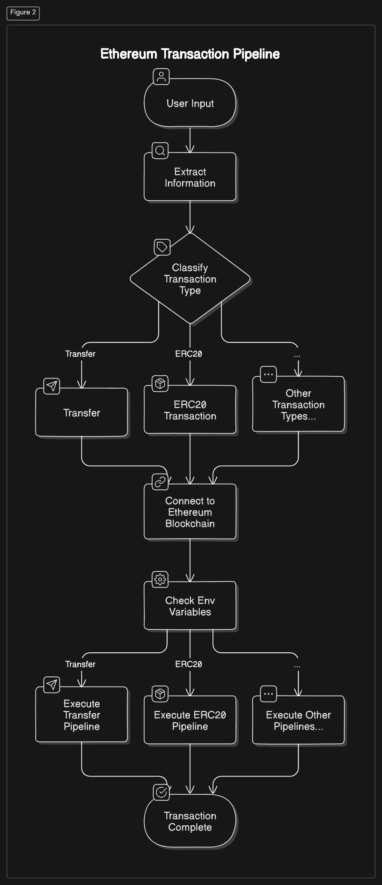

# LLM Based Proof-of-Concept **Intent** Solver 

## Table of Contents
1. [System Overview](#system-overview)
2. [What are Intents?](#what-are-intents)
3. [System Architecture](#system-architecture)
4. [From intent to Blockchain transaction](#from-intent-to-blockchain-transaction)

## System Overview
The system takes user inputs in natural language, processes the input using an LLM for **intent** extraction.


## What are Intents?
Intents are the primary actions or goals that users want to achieve when interacting with a system. In the context of this project, intents refer to the user's desired transaction type (e.g., sending ETH, swapping tokens, etc.) and the associated parameters (amount, recipient, token type). The system extracts these intents from user-provided natural language inputs to execute the corresponding blockchain transactions.

## System Architecture


This section provides an overview of how the system operates, from setting up the LLM for extracting intents to executing Ethereum transactions.

### 1. **LLM Setup (Dev phase)**

For this system, we utilize the `mistral-large-2407"` 


#### Key Parameters
- `max_new_tokens`: Maximum number of tokens generated by the model.
- `top_k`: Controls the diversity of token sampling.
- `top_p`: Adjusts the cumulative probability threshold for token sampling.
- `temperature`: Controls the randomness of token sampling.(for fact extraction it is typically set to 0.0 ).

### 2. **Intent Extraction**
Now that we have the LLM set up, we can use it to extract intents from user inputs. there are two main approaches to extract intents from the LLM output:
   #### Pydantic extractor
Pydantic can be effectively used alongside LLMs to ensure the extracted data is well-structured and validated. By defining Pydantic models that represent the expected data structure(in our case the intent), you can validate the outputs generated by the LLM and ensure they meet specific criteria.

Code Example
```python

class TransactionData(BaseModel):
    """Transaction data for Ethereum transactions."""

    transaction_type: constr(regex=r'^(transfer|transfer_erc20|swap_exact_tokens_for_tokens|swap_tokens_for_exact_tokens|swap_exact_eth_for_tokens|swap_eth_for_exact_tokens|wrap|unwrap)$') = Field(
        ...,
        description="Type of the transaction (e.g., transfer, transfer_erc20, swap, etc.)."
    )
    amount: str = Field(
        ..., description="Amount of tokens or ETH to be transacted."
    )
    token: Optional[str] = Field(
        None, description="Type of token for ERC-20 transactions and swaps."
    )
    recipient: str = Field(
        ..., description="Recipient wallet address for the transaction."
    )
```
   #### Prompt Engineering
Prompt engineering involves crafting specific prompts that guide the model to generate desired outputs. By providing context and constraints in the prompt, you can influence the model's behavior and improve the quality of generated outputs. This approach is particularly useful for fine-tuning LLMs to perform specific tasks, such as intent extraction.This was the approach we used in our case to extract the intent from the LLM output.
Here is a snippet of the code that shows how we used prompt engineering to extract the intent from the LLM output.
```python
Intent_extraction_prompt =  prompt = PromptTemplate(
        template="""
            Extract the intent from the following user instruction. 
            Do not include any unnecessary or extra information.
            It is crucial to include the transaction_type.
            If the user does not mention the chain explicitly, set the "chain" field to null.
            The output should ALWAYS be a valid JSON object that conforms to the following schema:

            {intent_schema}

            User Instruction:
            {user_instruction}

            {format_instructions}
        """,
        input_variables=["user_instruction"],
        partial_variables={"intent_schema": TransactionIntent.model_json_schema(),
                           "format_instructions": parser.get_format_instructions()},
    )
```
What makes this approach very effictive is the fact that it's the simplest and most straightforward way to extract the intent from the LLM output.Also using handy tricks like pydantic or json formatting showed poor results(at least in this case) with open source LLMs in comparison with good results when using something like OpenAi's GPT-3.5 Turbo.

On the other hand, prompt engneering does not guarantee extracting intents in a disired format constantly, even when setting temperature to near zero we still get the LLM spitting out more than we want , so another extra step is needed to filter out the output(using the magic of regex) and extract the intent from it.

### 3. **From intent to Blockchain transaction**

Once we have extracted the intent from the user input, we can use the structured data to perform the corresponding Ethereum transaction. The system supports various transaction types, including:
- **ETH Transfer**: Sending Ether from one wallet to another.
- **ERC-20 Token Transfer**: Transferring ERC-20 tokens between wallets.
- **Token Swaps**: Exchanging tokens using decentralized exchanges (DEXs).
- **Wrapping/Unwrapping ETH**: Converting ETH to wrapped ETH (WETH) and vice versa.

Included in the extrcted intent is the type of the transaction , which is used as a router for the different transaction types.A simple but effective DAG pipeline approach.


